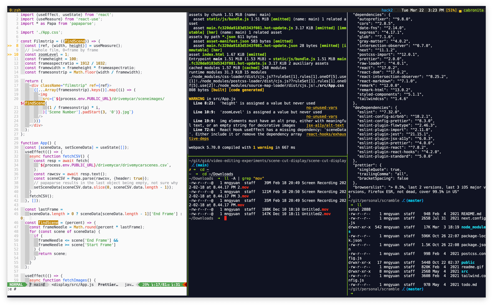

# Kevin Lee's dotfiles

Personal configuration files. I work mostly on frontend web development and these dotfiles are meant to be roughly cross platform compatible with Linux i.e. raspbian and Linux Mint.

## Terminal

Terminal emulator: [alacritty](https://github.com/alacritty/alacritty)

- text based configuration
- decently fast
- decent color support

## Shell

zsh with [ohmyzsh](https://github.com/ohmyzsh/ohmyzsh)

- easy to configure
- more widely available and less dogmatic than fish

[tmux](https://github.com/tmux/tmux/)

- [tmux-resurrect](https://github.com/tmux-plugins/tmux-resurrect) for session restore
  - somewhat annoying incompatiblility with changing cwd on buffer open in vim with session restoration

## Editor

[Neovim](https://github.com/neovim/neovim) / Vim

- [coc.nvim](https://github.com/neoclide/coc.nvim) for LSP, completions, formatting
- [prettier](https://github.com/prettier/prettier) for JS, TS, JSX, HTML, CSS formatting

## MacOS

[brew](https://github.com/Homebrew/brew) for package management

[Hammerspoon](https://github.com/Hammerspoon/hammerspoon) for window tiling

# makeMyselfAtHome.sh

For setting up new machines, [makeMyselfAtHome.sh](makeMyselfAtHome.sh) symlinks profile, conf, and rc files, and setup a ~/bin folder with necessary tools. Should non-destructively leave original files intact.
